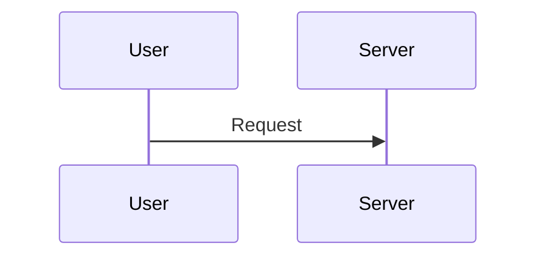

# Rhinestone Docs

Mintlify-based documentation site for the Rhinestone smart wallet platform, module development kit, and intents API.

Docs: https://docs.rhinestone.dev

## Commands

- `bunx mintlify dev` - Run local preview (port 3000)
- `bunx mintlify dev --port 3333` - Custom port
- `bunx mintlify dev --no-open` - Run without opening browser
- `bunx mintlify broken-links` - Check for broken links

Note: Mintlify requires Node 22 LTS. If you have multiple Node versions, ensure Node 22 is active.

## Stack

- Framework: Mintlify
- Content: MDX (Markdown + JSX)
- Configuration: `docs.json`
- Icons: Lucide

## Structure

- `/home` - Landing pages: intro, concepts, resources
- `/smart-wallet` - Smart Wallet SDK docs (accounts, signers, chain abstraction, sessions)
- `/intents` - Intents API docs (quotes, signing, submitting, use cases)
- `/snippets` - Reusable MDX components (cards, icons)
- `/images` - Documentation images and screenshots
- `docs.json` - Mintlify site config (navigation, theme, tabs)

### Navigation

There are 4 tabs: Home, Smart Wallet SDK, Intents API, API Reference. Navigation is defined in `docs.json` under `navigation.tabs`. To add a new page:

1. Create the `.mdx` file in the correct directory
2. Add the page path to `docs.json` under the relevant tab's `groups[].pages[]` array
3. Use cases go in `intents/use-cases/<slug>`, guides go in `intents/guides/<slug>`

## Writing Style

- **Concise and direct.** No filler, no "In this guide, we will explore..." — get to the point.
- **Second-person, present tense.** "You sign the intent" not "The user signs the intent."
- **Code-first.** Show code examples early. Prose explains around them, not instead of them.
- **Link, don't duplicate.** If content exists in another guide (token requirements, error handling, status polling), link to it. Never duplicate status lists, error tables, or step-by-step flows that live elsewhere.
- **Naming:** Name guides by what differentiates them — the action ("Vault Deposit") or the pattern ("Automated Zaps"). Don't prefix titles with "Crosschain" when the page is already in the Intents API section (it's implied).
- **Sentence case headings.** All page titles, nav labels, and section headings use sentence case. Capitalise only the first word and proper nouns (e.g., Warp, ERC-7579, TypeScript). Wrong: "Getting A Quote". Right: "Getting a quote".

## MDX Components

All content files use `.mdx` extension with YAML frontmatter:

```mdx
---
title: "Page Title"
description: "Short description or empty string."
---
```

### Tabs (rich content switching)

Use `<Tabs>` / `<Tab>` for content that branches by account type (EOA vs Smart Account) or auth method (ECDSA vs Passkeys). **Blank lines are required** after opening tags and before closing tags:

```mdx
<Tabs>
<Tab title="EOA">

Content here...

</Tab>
<Tab title="Smart Account">

Content here...

</Tab>
</Tabs>
```

### CodeGroup (code-only tabs)

Use `<CodeGroup dropdown>` for code-only tab switching. The tab label comes from the second word in the fence info string:

````mdx
<CodeGroup dropdown>

```ts Get Quote
const response = await fetch(...)
```

```ts Submit Intent
const result = await fetch(...)
```

</CodeGroup>
````

### Steps (numbered tutorials)

```mdx
<Steps>
<Step title="Get a Quote">

Content...

</Step>
<Step title="Sign the Intent">

Content...

</Step>
</Steps>
```

### Callouts

- `<Note>` — neutral information
- `<Info>` — supplementary context
- `<Tip>` — best practice or shortcut
- `<Warning>` — gotcha or danger

### Cards

```mdx
<CardGroup cols={2}>
<Card title="Getting a Quote" icon="message-circle" href="/intents/guides/getting-a-quote">
  Learn how to request a quote from the orchestrator.
</Card>
</CardGroup>
```

Icons are Lucide names. Be aware that some Lucide icon names don't render in Mintlify — test locally before committing icon-heavy card groups. When in doubt, skip the icon prop.

### Mermaid diagrams

Always use `actions={false}` to disable pan/zoom controls:

````mdx

````

### Code blocks

Use TypeScript for all code examples. Highlight specific lines with curly braces:

````mdx
```ts {11}
// line 11 will be highlighted
```
````

## Intents API Technical Context

The main branching point in Intents API docs is **EOA vs Smart Account**. Use `<Tabs>` to present both paths whenever the implementation differs.

### EOA Flow
- User must handle token requirements manually (approve tokens to Permit2, wrap ETH)
- Signing uses Permit2 EIP-712 typed data
- Destination executions run in an intermediary contract (not the user's account)
- Vault shares or other received tokens must be explicitly transferred back to the user

### Smart Account Flow (ERC-7579)
- Pre-claim operations handle token requirements automatically
- The IntentExecutor module runs destination executions in the account's own context
- Signing uses emissary/ownable signature encoding
- No manual token transfers needed — tokens stay in the account

### API Endpoints
- Base URL: `https://v1.orchestrator.rhinestone.dev`
- Auth: `x-api-key` header
- `POST /intents/route` — get a quote
- `POST /intent-operations` — submit a signed intent
- `GET /intent-operation/:id` — poll for completion status

### Guide Architecture Patterns

There are two levels of abstraction for Intents API guides:

1. **Raw API guides** (e.g., "Vault Deposit"): Use raw `viem` + `fetch`, user signs directly, `<Tabs>` for EOA vs Smart Account paths
2. **SDK guides** (e.g., "Automated Zaps"): Use `@rhinestone/sdk`, companion account pattern, session keys for app-operated flows

These two levels coexist as separate pages. Differentiate by naming and intro copy. When guides overlap in scope but differ in abstraction or interaction model, keep them as separate pages with cross-references between them.

## Review Checklist

Before submitting docs changes:

1. Run `bunx mintlify broken-links` to catch dead links
2. Run `bunx mintlify dev` and visually check your pages render correctly
3. Verify `<Tabs>` and `<CodeGroup>` have correct blank line spacing (common rendering issue)
4. Check that you're linking to existing guides for shared concepts (token requirements, signing, error handling) rather than re-explaining them
5. Confirm new pages are added to `docs.json` navigation
6. Keep use case pages concise — cut anything that duplicates content from the guides section
