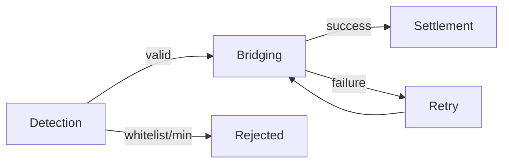

Once an account is registered, the deposit service handles everything from detection to settlement. This page explains what happens at each stage and how to monitor the process.

## Deposit lifecycle



### Detection

The service monitors registered accounts via chain indexer webhooks. When a token transfer is detected on a registered account, it goes through validation:

- The token and amount are checked against your [deposit whitelist](/deposits/api/initial-setup#restrict-accepted-deposits) (if configured)
- The transfer is deduplicated by chain, transaction hash, account, and token
- If valid, the deposit enters the pipeline with status `processing`
- If the token isn't allowed or the amount is outside your configured min/max, the deposit is **rejected** (not bridged) and a [`deposit-rejected`](/deposits/api/status-tracking#deposit-rejected) webhook is sent after `deposit-received`

### Bridging

The service submits a bridging intent to the Rhinestone Orchestrator, which routes the funds through the optimal settlement layer (Across, Relay, or others). If the primary layer fails, the service tries alternatives automatically.

### Settlement

Tokens arrive on the target chain in the registered target token. If a recipient address was set at registration, funds are forwarded there. The service marks the deposit as `completed` and sends a `bridge-complete` [webhook](/deposits/api/status-tracking#webhooks).

## Deposit statuses

| Status | Meaning |
|---|---|
| `processing` | Deposit detected, bridging in progress |
| `completed` | Funds arrived on target chain |
| `failed` | Bridging failed — may be retried automatically |

## Retries

### Automatic

Transient errors — bridge failures, session activation issues, and internal errors — are retried automatically. Configuration errors like unsupported tokens, insufficient balance, or unregistered accounts require manual resolution.

### Manual

Force an immediate retry of all failed deposits for an account:

```ts
const response = await fetch(`${DEPOSIT_SERVICE_URL}/deposits/retry`, {
  method: "POST",
  headers: {
    "Content-Type": "application/json",
    "x-api-key": API_KEY,
  },
  body: JSON.stringify({
    address: accountAddress,
  }),
});

const { deposits } = await response.json();
// [{ txHash: "0x...", chain: "eip155:8453" }, ...]
```

## Error codes

When a deposit fails, the error code indicates what went wrong and whether the service will retry automatically.

### Retryable

These are transient failures. The service retries automatically, or you can trigger a [manual retry](#manual).

| Code | Description |
|---|---|
| `SESSION-2` | Session key activation failed |
| `BRIDGE-1` | Bridge submission failed |
| `BRIDGE-2` | No bridge quote available |
| `BRIDGE-3` | Bridge timed out |
| `BRIDGE-4` | Bridge provider failed |
| `BRIDGE-5` | Price deviation exceeded tolerance |
| `BRIDGE-7` | Bridge refunded |
| `BRIDGE-8` | Bridge cancelled |
| `BRIDGE-9` | Bridge rejected |
| `SWAP-1` | Post-bridge swap failed |
| `INTERNAL-1` | Unexpected service error |

### Non-retryable

These indicate a configuration or input problem. Check account registration, deposit whitelist, and token support.

| Code | Description |
|---|---|
| `BALANCE-1` | Account balance too low for bridging |
| `BALANCE-2` | Account balance could not be read |
| `BALANCE-3` | Deposit amount above the configured maximum |
| `BALANCE-4` | Deposit amount below the configured minimum |
| `TOKEN-1` | Token not supported on this chain |
| `TOKEN-2` | Token account (Solana ATA) creation failed |
| `TOKEN-3` | Token not in deposit whitelist |
| `ACCOUNT-1` | Account not registered |
| `ACCOUNT-2` | Account (Solana Swig wallet) creation failed |
| `SESSION-1` | Smart session not found — resolved by re-registering the account |
| `TRANSFER-1` | Transfer execution failed |
| `BRIDGE-6` | Unsupported bridge route — no route available; the deposit is rejected, not retried |

<Note>
Failed deposits with non-retryable errors will not be retried automatically. Resolve the underlying issue (e.g. update your deposit whitelist or register the account) before triggering a manual retry.
</Note>

<Note>
Whitelist and minimum rejections (`BALANCE-4`, `BALANCE-3`, `TOKEN-3`) are deposits the service deliberately won't bridge per your configuration. These are surfaced via the [`deposit-rejected`](/deposits/api/status-tracking#deposit-rejected) webhook — not `bridge-failed` — and no bridging is attempted.
</Note>
