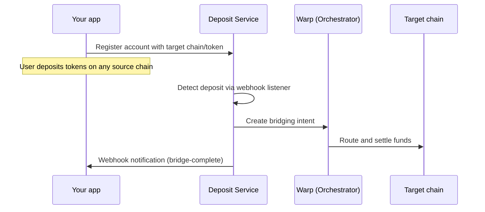

Rhinestone Deposits is a cross-chain deposit infrastructure that lets you accept tokens from users on any supported chain and deliver them to a target chain and token automatically. You don't need to build bridging logic, manage gas across chains, or handle token swaps — the service detects deposits, bridges them via [Warp](/home/introduction/rhinestone-intents), and notifies your app when funds arrive.

It's built for teams that need reliable deposit rails: neobanks, modern dapps, DeFi protocols, or any app that onboards users from multiple chains.

## Two ways to integrate

<Tabs>
<Tab title="Deposit API">

A headless backend service for programmatic deposit handling. You register accounts, configure webhooks, and process deposits server-side. Full control over the deposit flow.

<Frame caption="Example of an integration into a mobile app">
  <video src="/images/deposits_api_integration.mp4" muted loop controls className="rounded-2xl" style={{ maxHeight: "500px", margin: "0 auto" }} />
</Frame>

[Get started with the Deposit API →](/deposits/api/quickstart)

</Tab>
<Tab title="Deposit Widget">

A drop-in React modal that handles wallet connection, chain selection, and deposit execution out of the box. Minimal frontend effort for a polished deposit experience.

<Frame caption="Widget UI">
  <video src="/images/deposits_widget_ui.mov" muted loop controls className="rounded-2xl" style={{ maxHeight: "500px", margin: "0 auto" }} />
</Frame>

[Get started with the Deposit Widget →](/deposits/widget/quickstart)

</Tab>
</Tabs>

## How it works

1. You register a smart account with a target chain and token
2. The user transfers tokens to their smart account on any supported source chain
3. The deposit service detects the transfer, creates a bridging intent via Warp, and routes the funds to the target chain
4. Your app receives a webhook notification when the deposit completes

The user makes a single transfer. Everything else — bridging, swaps, gas — is handled automatically.

## Why Deposits

Deposits are self-custodial by design — funds are held in the user's smart account at every step, and Rhinestone never takes custody. Stablecoin swaps settle at parity, fees can be fully sponsored, and destination calls let funds land directly into a vault or position. The result is a deposit rail that feels like a native single-chain transfer, without the trust trade-offs of a centralized bridge.

Under the hood, Rhinestone aggregates multiple bridging providers, solvers, and quoting services, routing each deposit through the best available path. If one provider is degraded or a route is unavailable, the service falls back automatically — giving you a single integration with the reliability of several.

## Key features

- **Automatic bridging** — deposits are detected and bridged to the target chain without any user interaction beyond the initial transfer
- **Multi-chain support** — accept deposits from Ethereum, Base, Arbitrum, Optimism, Polygon, and Solana, with more chains added regularly
- **1:1 stablecoin swaps** — USDC and USDT are swapped at parity
- **Swap routing** — route between tokens as part of the deposit
- **Calls on destination** — trigger contract calls on the target chain once funds arrive
- **Fee sponsorship** — cover gas, bridging, and swap fees on a per-chain basis

## User experience

From the user's perspective, depositing is a simple token transfer — send tokens to an address on any supported chain. There's no bridging UI, no gas token management, and no chain switching.

With the **widget**, the experience is even more streamlined: the user connects their wallet, selects a chain and token, and confirms the deposit — all within a single modal. The widget also supports withdrawals.

With the **API**, you control the UX entirely. The user interacts with your app however you design it, and the deposit service handles everything behind the scenes.

## Supported chains and tokens

{/*
  Source: GET https://v1.orchestrator.rhinestone.dev/deposit-processor/chains

  Hardcoded as plain markdown tables so they render at SSR time (no client-side
  fetch, no flash-of-loading). Refresh manually when the upstream list changes.
*/}

Rhinestone Deposits supports a wide range of EVM chains plus Solana. Each chain is enabled as a **source** (the user can deposit from it), a **destination** (funds can settle on it), or both.

- **Deposit** — users can transfer tokens on this chain and have them bridged to the target.
- **Destination** — accounts on this chain can be registered as the target where funds land.
- **Tokens** — `All` means any token routable through Warp; otherwise, only the listed tokens are accepted.

### Mainnet

| Name            | Deposit | Destination | Tokens          |
| :-------------- | :-----: | :---------: | :-------------- |
| Ethereum        |    ✓    |      ✓      | All             |
| OP Mainnet      |    ✓    |      ✓      | All             |
| BNB Smart Chain |    ✓    |      ✓      | All             |
| Gnosis          |    —    |      ✓      | All             |
| Polygon         |    ✓    |      ✓      | All             |
| Sonic           |    —    |      ✓      | All             |
| HyperEVM        |    —    |      ✓      | USDC, USDT0     |
| Soneium         |    ✓    |      ✓      | ETH, USDC, WETH |
| Base            |    ✓    |      ✓      | All             |
| Plasma          |    ✓    |      ✓      | All             |
| Arbitrum One    |    ✓    |      ✓      | All             |
| Solana          |    ✓    |      —      | USDC, USDT, SOL |

### Testnet

| Name             | Deposit | Destination | Tokens                   |
| :--------------- | :-----: | :---------: | :----------------------- |
| Sepolia          |    ✓    |      ✓      | ETH, USDC, WETH          |
| OP Sepolia       |    ✓    |      ✓      | ETH, USDC, WETH          |
| Base Sepolia     |    ✓    |      ✓      | ETH, USDC, WETH, MockUSD |
| Arbitrum Sepolia |    ✓    |      ✓      | ETH, USDC, WETH          |
| Plasma Testnet   |    —    |      ✓      | USDT0, USDC              |

<Info>
  This data is also available programmatically via the [List supported chains
  and tokens](/api-reference/info/list-supported-chains-and-tokens) endpoint.
</Info>

## Which should you use?

|                    | Deposit API                          | Deposit Widget                          |
| ------------------ | ------------------------------------ | --------------------------------------- |
| Integration effort | Moderate — backend + webhook handler | Low — drop in a React component         |
| UI control         | Full — build your own                | Themed modal with customization options |
| Deposit triggers   | Any transfer to the smart account    | User-initiated via the modal            |
| Withdrawal support | Manual                               | Built-in withdraw modal                 |
