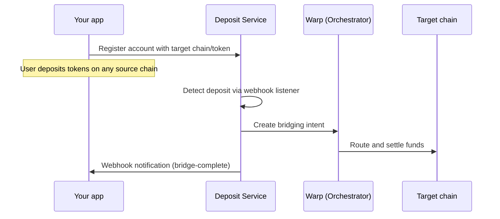

Rhinestone Deposits is a cross-chain deposit infrastructure that lets you accept tokens from users on any supported chain and deliver them to a target chain and token automatically. You don't need to build bridging logic, manage gas across chains, or handle token swaps — the service detects deposits, bridges them via [Warp](/home/introduction/rhinestone-intents), and notifies your app when funds arrive.

It's built for teams that need reliable deposit rails: neobanks, modern dapps, DeFi protocols, or any app that onboards users from multiple chains.

## Two ways to integrate

<CardGroup cols={2}>
<Card title="Deposit API" icon="code" href="/deposits/api/quickstart">
  A headless backend service for programmatic deposit handling. You register accounts, configure webhooks, and process deposits server-side. Full control over the deposit flow.
</Card>
<Card title="Deposit Widget" icon="panel-top" href="/deposits/widget/quickstart">
  A drop-in React modal that handles wallet connection, chain selection, and deposit execution out of the box. Minimal frontend effort for a polished deposit experience.
</Card>
</CardGroup>

## How it works

1. You register a smart account with a target chain and token
2. The user transfers tokens to their smart account on any supported source chain
3. The deposit service detects the transfer, creates a bridging intent via Warp, and routes the funds to the target chain
4. Your app receives a webhook notification when the deposit completes

The user makes a single transfer. Everything else — bridging, swaps, gas — is handled automatically.

## Key features

- **Automatic bridging** — deposits are detected and bridged to the target chain without any user interaction beyond the initial transfer
- **Multi-chain support** — accept deposits from Ethereum, Base, Arbitrum, Optimism, Polygon, and Solana, with more chains added regularly
- **Fee sponsorship** — cover gas, bridging, and swap fees for your users on a per-chain basis, so deposits are zero-cost from the user's perspective
- **Webhook notifications** — receive real-time updates for each stage of the deposit lifecycle: received, bridge started, bridge complete, or bridge failed
- **Retry and recovery** — failed deposits are automatically retried with exponential backoff, with manual retry available via the API

## User experience

From the user's perspective, depositing is a simple token transfer — send tokens to an address on any supported chain. There's no bridging UI, no gas token management, and no chain switching.

With the **widget**, the experience is even more streamlined: the user connects their wallet, selects a chain and token, and confirms the deposit — all within a single modal. The widget also supports withdrawals.

With the **API**, you control the UX entirely. The user interacts with your app however you design it, and the deposit service handles everything behind the scenes.

## Supported chains and tokens

Deposits can be sent from any supported EVM chain (Ethereum, Base, Optimism, Arbitrum, Polygon, and others) as well as Solana. Funds are bridged to any supported EVM target chain.

Supported tokens include USDC, USDT, ETH, and WETH, with coverage varying by chain.

For the full list, see [supported chains](/home/resources/supported-chains). You can also query the available chains and tokens programmatically via the [List supported chains and tokens](/api-reference/info/list-supported-chains-and-tokens) endpoint.

## Which should you use?

| | Deposit API | Deposit Widget |
|---|---|---|
| Integration effort | Moderate — backend + webhook handler | Low — drop in a React component |
| UI control | Full — build your own | Themed modal with customization options |
| Deposit triggers | Any transfer to the smart account | User-initiated via the modal |
| Withdrawal support | Manual | Built-in withdraw modal |
