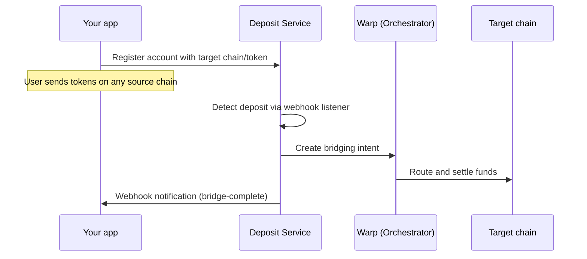

export const DepositChainsTable = ({ chains }) => (
  <table className="min-w-full">
    <thead>
      <tr className="border-b border-gray-200 dark:border-gray-700">
        <th className="text-left py-2 pr-4 font-semibold">Name</th>
        <th className="text-center py-2 pr-4 font-semibold">Source</th>
        <th className="text-center py-2 pr-4 font-semibold">Destination</th>
        <th className="text-left py-2 font-semibold">Tokens</th>
      </tr>
    </thead>
    <tbody>
      {chains.map((chain) => (
        <tr key={chain.id} className="border-b border-gray-100 dark:border-gray-800">
          <td className="py-2 pr-4">{chain.name}</td>
          <td className="py-2 pr-4 text-center">{chain.deposit ? '✓' : '—'}</td>
          <td className="py-2 pr-4 text-center">{chain.destination ? '✓' : '—'}</td>
          <td className="py-2">{chain.supportedTokens === 'all' ? 'All' : (chain.supportedTokens?.map(t => t.symbol).join(', ') || '-')}</td>
        </tr>
      ))}
    </tbody>
  </table>
);

export const DepositChains = () => {
  const [chains, setChains] = React.useState([]);
  const [loading, setLoading] = React.useState(true);
  const [error, setError] = React.useState(null);

  React.useEffect(() => {
    fetch("https://v1.orchestrator.rhinestone.dev/deposit-processor/chains")
      .then(res => {
        if (!res.ok) throw new Error('Failed to fetch chains');
        return res.json();
      })
      .then(data => {
        const byName = new Map();
        Object.entries(data).forEach(([id, chain]) => {
          const kept = byName.get(chain.name);
          // A virtual chain can be advertised twice: once under its canonical
          // CAIP-2 namespace and once as `eip155:<synthetic id>`. Keep the
          // canonical entry, which carries the accurate capability flags.
          const isCanonical = !id.startsWith('eip155:');
          if (!kept || (isCanonical && kept.id.startsWith('eip155:'))) {
            byName.set(chain.name, { ...chain, id });
          }
        });
        setChains([...byName.values()].sort((a, b) => a.name.localeCompare(b.name)));
        setLoading(false);
      })
      .catch(err => {
        setError(err.message);
        setLoading(false);
      });
  }, []);

  if (loading) {
    return 
Loading chains...
;
  }

  if (error) {
    return 
Error loading chains: {error}
;
  }

  const mainnets = chains.filter(chain => !chain.testnet);
  const testnets = chains.filter(chain => chain.testnet);

  return (
    <>
      <h3>Mainnet</h3>
      <DepositChainsTable chains={mainnets} />
      <h3>Testnet</h3>
      <DepositChainsTable chains={testnets} />
    </>
  );
};

Rhinestone Deposits is a cross-chain deposit infrastructure that lets you accept tokens from users on any supported chain and deliver them to a target chain and token automatically. You don't need to build bridging logic, manage gas across chains, or handle token swaps — the service detects deposits, bridges them via [Warp](/home/introduction/rhinestone-intents), and notifies your app when funds arrive.

It's built for teams that need reliable deposit rails: neobanks, modern dapps, DeFi protocols, or any app that onboards users from multiple chains.

It supports a wide range of EVM chains and Solana — see [supported chains and tokens](#supported-chains-and-tokens) below.

## Two ways to integrate

**Start with the widget.** It ships the whole deposit UI — funding methods, chain and token selection, status screens, withdrawals and refunds — and it uses the same API underneath, so nothing is closed off later. Reach for the API directly when you're not building in React, or when you want a deposit flow that doesn't look like a modal.

<Tabs>
<Tab title="Deposit Widget">

A React modal that handles funding method, chain and token selection, and deposit execution out of the box. Also covers [fiat and exchange funding](/deposits/widget/deposit-modal#funding-methods), [withdrawals](/deposits/widget/withdraw-modal), [refunds](/deposits/widget/claim-modal), and [migrating balances from other apps](/deposits/widget/asset-migrations) (e.g. Polymarket).

<Frame caption="Widget UI">
  <video src="/images/deposits_widget_ui.mp4" muted loop controls className="rounded-2xl" style={{ maxHeight: "500px", margin: "0 auto" }} />
</Frame>

[Get started with the Deposit Widget →](/deposits/widget/quickstart)

</Tab>
<Tab title="Deposit API">

A headless backend service for programmatic deposit handling. You register accounts, configure webhooks, and process deposits server-side, and you build the UI. Use it for native mobile, non-React frontends, or fully custom flows.

<Frame caption="Example of an integration into a mobile app">
  <video src="/images/deposits_api_integration.mp4" muted loop controls className="rounded-2xl" style={{ maxHeight: "500px", margin: "0 auto" }} />
</Frame>

[Get started with the Deposit API →](/deposits/api/quickstart)

</Tab>
</Tabs>

## How it works

```mermaid actions={false}
sequenceDiagram
    participant App as Your app
    participant DS as Deposit Service
    participant Warp as Warp (Orchestrator)
    participant Dest as Target chain

    App->>DS: Register account with target chain/token
    Note over App: User sends tokens on any source chain
    DS->>DS: Detect deposit via webhook listener
    DS->>Warp: Create bridging intent
    Warp->>Dest: Route and settle funds
    DS->>App: Webhook notification (bridge-complete)
```

1. You register a smart account with a target chain and token
2. The user transfers tokens to their smart account on any supported source chain
3. The deposit service detects the transfer, creates a bridging intent via Warp, and routes the funds to the target chain
4. Your app receives a webhook notification when the deposit completes

The user makes a single transfer. Everything else — bridging, swaps, gas — is handled automatically.

## Why Deposits

Deposits are self-custodial by design — funds are held in the user's smart account at every step, and Rhinestone never takes custody. Stablecoin swaps settle at parity and fees can be fully sponsored. The result is a deposit rail that feels like a native single-chain transfer, without the trust trade-offs of a centralized bridge.

Under the hood, Rhinestone aggregates multiple bridging providers, solvers, and quoting services, routing each deposit through the best available path. If one provider is degraded or a route is unavailable, the service falls back automatically — giving you a single integration with the reliability of several.

## Key features

- **Automatic bridging** — deposits are detected and bridged to the target chain without any user interaction beyond the initial transfer
- **Multi-chain support** — accept deposits from [any supported chain](#supported-chains-and-tokens), EVM or Solana, with more added regularly
- **1:1 stablecoin swaps** — USDC and USDT are swapped at parity
- **Swap routing** — route between tokens as part of the deposit
- **Fee sponsorship** — cover gas, bridging, and swap fees on a per-chain basis

## User experience

From the user's perspective, depositing is a simple token transfer — send tokens to an address on any supported chain. There's no bridging UI, no gas token management, and no chain switching.

With the **widget**, the user picks how to fund — connected wallet, QR transfer, card, or an exchange — then confirms, all in one modal. Withdrawals and refunds have their own modals.

With the **API**, you control the UX entirely. The user interacts with your app however you design it, and the deposit service handles everything behind the scenes.

## Supported chains and tokens

Rhinestone Deposits supports a wide range of EVM chains plus Solana. Each chain is enabled as a **source** (the user can send funds to it), a **destination** (funds can settle on it), or both.

- **Source** — users can transfer tokens on this chain and have them bridged to the target.
- **Destination** — accounts on this chain can be registered as the target where funds land.
- **Tokens** — `All` means any token routable through Warp; otherwise, only the listed tokens are accepted.

<DepositChains />

<Info>
  This data is also available programmatically via the [List supported chains
  and tokens](/api-reference/deposit-service/utilities/list-supported-chains-and-tokens) endpoint.
</Info>

## Which should you use?

|                     | Deposit Widget                                                      | Deposit API                          |
| ------------------- | ------------------------------------------------------------------- | ------------------------------------ |
| Frontend            | React component, themeable, modal or inline                         | You build it                         |
| Backend             | A [proxy holding your API key](/deposits/widget/backend) — ours or your own | Your service, holding the key        |
| Deposit triggers    | Any transfer to the deposit account, plus in-modal funding          | Any transfer to the deposit account  |
| Fiat / exchange     | Card, Apple Pay, bank and CEX funding, UI included                  | [Endpoints](/deposits/api/onramp); you build the UI |
| Withdrawals         | [Withdraw modal](/deposits/widget/withdraw-modal); your app signs the transfer | You build it                         |
| Refunds             | [Claim modal](/deposits/widget/claim-modal) for users, plus the dashboard | Dashboard, or build your own         |
| Status              | Lifecycle callbacks in the browser                                  | [Webhooks](/deposits/api/status-tracking) server-side |

Both need a backend, and both see the same deposits — a user who sends funds to the deposit address never touches your UI either way. Most widget integrations also want [webhooks](/deposits/widget/backend#webhooks), for fulfilment that can't depend on the modal being open.
