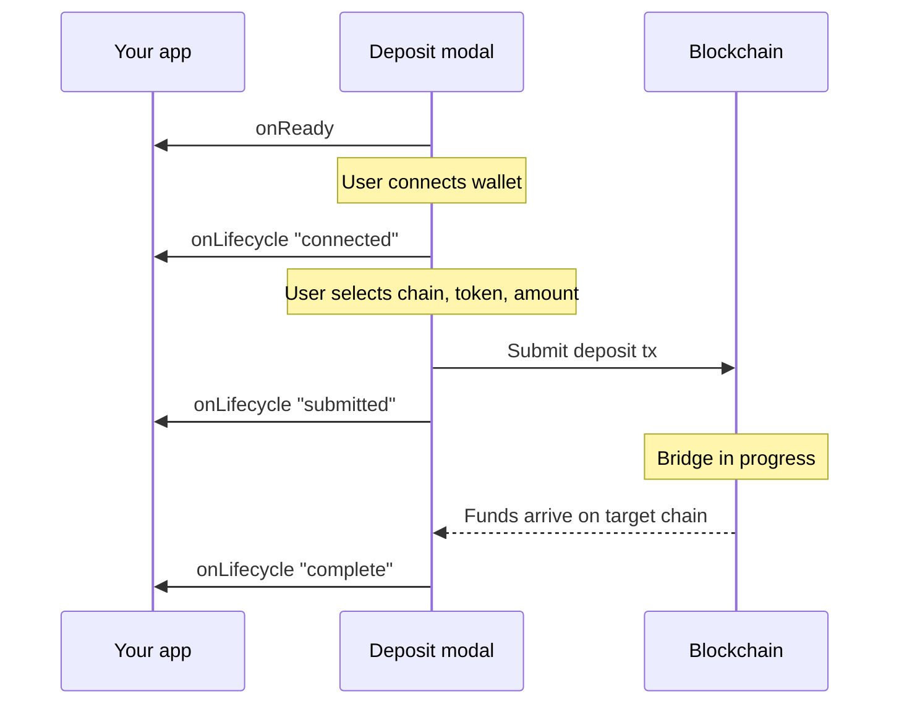

The modal emits every state transition through a single `onLifecycle` callback.
You switch on `event.type` to update your UI, trigger backend processes, or log
analytics. New event variants can be added without changing the prop surface.

## Deposit lifecycle



1. The modal initializes and fires `onReady`
2. The user connects a wallet (or is connected via an embedded wallet). The
   modal creates a smart account and emits `"connected"` with the EOA `address`
   and `smartAccount` address.
3. The user selects a source chain, token, and amount, then confirms
4. The modal submits the transaction on the source chain and emits `"submitted"`
5. The bridge routes funds to the target chain. Once they arrive, the modal
   emits `"complete"`

If the bridge fails after submission, `"failed"` is emitted instead of
`"complete"`.

## onLifecycle

`onLifecycle` receives a discriminated union — `DepositLifecycleEvent` on
`<DepositModal>`, `WithdrawLifecycleEvent` on `<WithdrawModal>`. The two are
similar but not identical; see [withdraw events](#withdraw-events) for the
differences.

```tsx
import type { DepositLifecycleEvent } from "@rhinestone/deposit-modal";

<DepositModal
  // ...required props
  onLifecycle={(event: DepositLifecycleEvent) => {
    switch (event.type) {
      case "connected":
        console.log("smart account", event.smartAccount);
        break;
      case "submitted":
        console.log("source tx", event.txHash, "on", event.sourceChain);
        break;
      case "complete":
        console.log("done", event.destinationTxHash, event.amount);
        break;
      case "failed":
        console.error("failed", event.txHash, event.error);
        break;
      case "balance-changed":
        setBalance(event.totalUsd);
        break;
      case "smart-account-changed":
        setSmartAccount({ evm: event.evm, solana: event.solana });
        break;
    }
  }}
/>
```

### Deposit events

| `event.type` | Fields | Description |
|---|---|---|
| `"connected"` | `address: Address`, `smartAccount: Address` | Smart account created for the deposit |
| `"submitted"` | `txHash: string`, `sourceChain: ChainId \| "unknown"`, `amount: string` | Deposit transaction submitted on the source chain |
| `"complete"` | `txHash: string`, `destinationTxHash?: string`, `amount: string`, `sourceChain: ChainId \| "unknown"`, `sourceToken?: string`, `targetChain: number \| "solana"`, `targetToken: string` | Tokens arrived on the target chain |
| `"failed"` | `txHash: string`, `error?: string` | Bridge or transfer failed after submission |
| `"balance-changed"` | `totalUsd: number` | The user's total portfolio balance (USD) changed |
| `"smart-account-changed"` | `evm: Address \| null`, `solana: string \| null` | The resolved smart account addresses changed |

`amount` is the deposit amount in the token's smallest unit.

<Warning>
`sourceChain: "unknown"` is deposit-only. When a webhook-detected deposit
arrives without chain or token information, `sourceChain` is `"unknown"` and
`sourceToken` is `undefined` — handle this branch so you don't pick the wrong
explorer URL.
</Warning>

### Withdraw events

`WithdrawLifecycleEvent` carries the same `type` values minus `"balance-changed"`
and `"smart-account-changed"`. Its `txHash` is `Hex`, `sourceChain` is always a
`number`, `sourceToken` / `targetToken` are `Address`, and `"submitted"` adds a
`safeAddress: Address` field.

## onReady

Fires once when the modal is initialized and ready for interaction. No payload.

```tsx
onReady={() => console.log("modal ready")}
```

## onError

Fires on errors at any stage — wallet connection, transaction signing, bridge
setup — that prevent the deposit from being submitted. Distinct from the
`"failed"` lifecycle event, which covers failures after the source transaction
confirms.

```tsx
onError={(data) => console.error(`[${data.code}] ${data.message}`)}
```

| Field | Type | Description |
|---|---|---|
| `message` | `string` | Error description |
| `code` | `string \| undefined` | Error code, if available |

For bridge-level error codes, see [deposit processing error codes](/deposits/api/deposit-processing#error-codes).

## Error handling

| Stage | Signal | Typical causes |
|---|---|---|
| Wallet connection | `onError` | User rejected connection, network error |
| Transaction signing | `onError` | User rejected transaction, insufficient gas |
| After submission | `onLifecycle` `"failed"` | Bridge failure, timeout, price deviation |
| Any stage | `onError` | Unexpected errors |

After the source chain transaction confirms, the deposit service may
[retry automatically](/deposits/api/deposit-processing#retries) before the
`"failed"` event fires.

## Analytics

The `onEvent` callback fires on granular user interactions for your analytics
pipeline. Its payload type is `DepositAnalyticsEvent` (or
`WithdrawAnalyticsEvent`).

```tsx
import type { DepositAnalyticsEvent } from "@rhinestone/deposit-modal";

onEvent={(event: DepositAnalyticsEvent) => {
  analytics.track(event.type, event);
}}
```

Events include modal views (`*_open`) and CTA clicks (`*_cta_click`) at each
step of the flow, with contextual properties like selected token, chain, and
amount.
