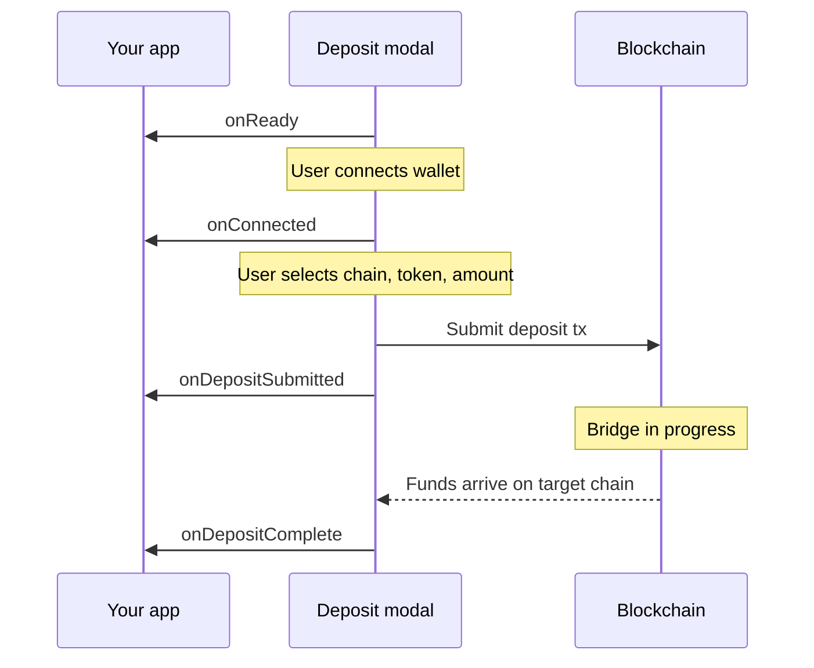

The deposit modal fires callbacks at each stage of the deposit lifecycle. Use these to update your UI, trigger backend processes, or log analytics.

## Deposit lifecycle



1. The modal initializes and fires `onReady`
2. The user connects a wallet (or is connected via embedded wallet). The modal creates a smart account and fires `onConnected` with the EOA `address` and `smartAccount` address.
3. The user selects a source chain, token, and amount, then confirms the deposit
4. The modal submits the transaction on the source chain and fires `onDepositSubmitted`
5. The bridge routes funds to the target chain. When `waitForFinalTx` is `true` (default), the modal waits for destination chain confirmation before firing `onDepositComplete`

If the bridge fails after submission, `onDepositFailed` fires instead of `onDepositComplete`.

## Event callbacks

### onReady

Fires when the modal is initialized and ready for interaction. No payload.

```tsx
onReady={() => {
  console.log("Modal ready");
}}
```

### onConnected

Fires when a smart account has been created for the deposit.

```tsx
onConnected={(data) => {
  console.log("EOA:", data.address);
  console.log("Smart account:", data.smartAccount);
}}
```

| Field | Type | Description |
|---|---|---|
| `address` | `Address` | The user's EOA or owner address |
| `smartAccount` | `Address` | The smart account address that receives deposits |

### onDepositSubmitted

Fires when the user signs and submits the deposit transaction on the source chain.

```tsx
onDepositSubmitted={(data) => {
  console.log("Submitted:", data.txHash, "on chain", data.sourceChain);
}}
```

| Field | Type | Description |
|---|---|---|
| `txHash` | `string` | Source chain transaction hash |
| `sourceChain` | `number \| "solana"` | Source chain ID |
| `amount` | `string` | Deposit amount in the token's smallest unit |

### onDepositComplete

Fires when tokens arrive on the target chain (or when the bridge is submitted, if `waitForFinalTx` is `false`).

```tsx
onDepositComplete={(data) => {
  console.log("Completed:", data.destinationTxHash);
  console.log("Amount:", data.amount);
}}
```

| Field | Type | Description |
|---|---|---|
| `txHash` | `string` | Source chain transaction hash |
| `destinationTxHash` | `string \| undefined` | Target chain transaction hash. Absent when `waitForFinalTx` is `false`. |
| `amount` | `string` | Amount transferred |
| `sourceChain` | `number \| "solana"` | Source chain ID |
| `sourceToken` | `string` | Source token address |
| `targetChain` | `number` | Target chain ID |
| `targetToken` | `string` | Target token address |

### onDepositFailed

Fires when the bridge fails after the deposit was submitted.

```tsx
onDepositFailed={(data) => {
  console.log("Failed:", data.txHash, data.error);
}}
```

| Field | Type | Description |
|---|---|---|
| `txHash` | `string` | Source chain transaction hash |
| `error` | `string \| undefined` | Error message, if available |

### onError

Fires on errors at any stage — wallet connection, transaction signing, bridge setup, etc.

```tsx
onError={(data) => {
  console.error(`[${data.code}] ${data.message}`);
}}
```

| Field | Type | Description |
|---|---|---|
| `message` | `string` | Error description |
| `code` | `string \| undefined` | Error code, if available |

For bridge-level error codes, see [deposit processing error codes](/deposits/api/deposit-processing#error-codes).

## Error handling

Errors can occur at different stages:

| Stage | Callback | Typical causes |
|---|---|---|
| Wallet connection | `onError` | User rejected connection, network error |
| Transaction signing | `onError` | User rejected transaction, insufficient gas |
| After submission | `onDepositFailed` | Bridge failure, timeout, price deviation |
| Any stage | `onError` | Unexpected errors |

`onError` fires for errors that prevent the deposit from being submitted. `onDepositFailed` fires for failures that happen after the source chain transaction is confirmed — at that point, the deposit service may [retry automatically](/deposits/api/deposit-processing#retries).

## Analytics

The `onEvent` callback fires on granular user interactions for integration with your analytics pipeline.

```tsx
onEvent={(event) => {
  analytics.track(event.type, event);
}}
```

Events include modal views (`*_open`) and CTA clicks (`*_cta_click`) at each step of the flow, with contextual properties like selected token, chain, and amount.
