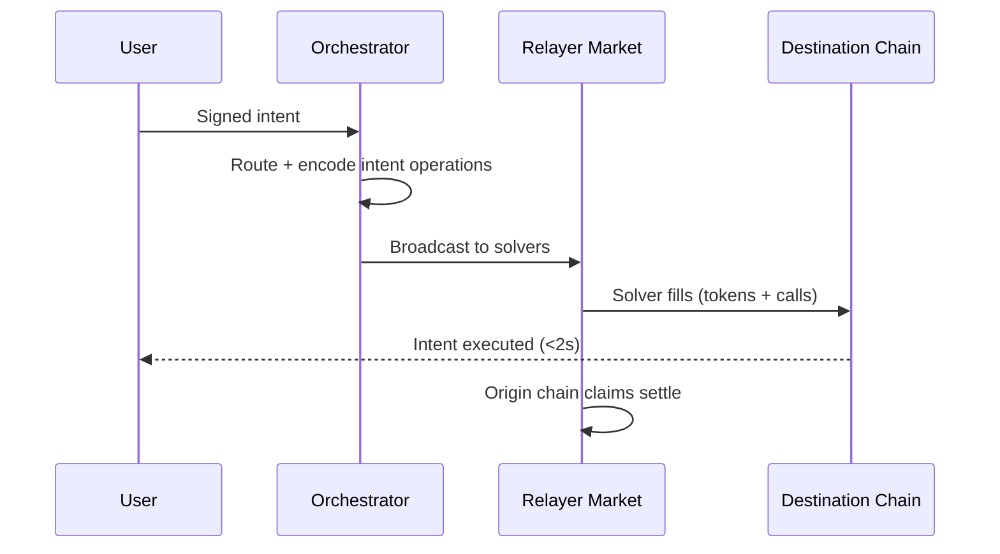

**Warp** is Rhinestone's intent routing and execution engine. It aggregates crosschain settlement layers through a unified solver market and executes intents with sub-2-second confirmation times.

## How it works

A Warp intent is a signed declaration of what the user wants to happen: which tokens to spend, on which chains, and what to execute at the destination. The user signs once — Warp handles the rest.

**A concrete example:** Alice wants to deposit 100 USDC into a Morpho vault on Arbitrum. She has 20 USDC on Sonic and 0.5 ETH on Soneium. She signs a single intent. Warp's Orchestrator finds that Eco offers the cheapest route from Sonic and Relay the cheapest from Soneium, builds the transactions, and coordinates execution across both settlement layers simultaneously. Alice's deposit lands on Arbitrum in under 2 seconds — she never touched a bridge.

## Intent flow

Origin chain settlement happens asynchronously after the destination fill. The user's transaction is complete once the fill lands — they don't wait for settlement finality.

## Components

### Orchestrator

The Orchestrator is an offchain service that transforms user intents into executable onchain transactions. It:

- Indexes user balances across all supported chains
- Finds the optimal route for each chain-token element in the intent
- Builds the fill and claim transaction data
- Broadcasts intent operations to the Relayer Market for execution

Warp intents are broken down into **chain-token elements**, each with an origin and destination chain transaction. Each element can be assigned to a different settlement layer, enabling intents to span multiple input tokens, input chains, and settlement layers simultaneously. This is what allows Warp to find the best route and price for every component of a complex intent.

### Relayer Market

Solvers in the Relayer Market listen for intent operations from the Orchestrator and compete to execute them. Warp aggregates settlement layers (Across, Relay, Eco, and others) not by aggregating their APIs, but through direct onchain integrations via the Intent Router. Each solver interacts with the relevant settlement layer's contracts directly.

This design enables:
- Broad chain and token coverage
- Best-price routing per chain-token element
- New settlement layers to be added without protocol changes

### Intent Router

The Intent Router is the onchain entry point for Warp intents. It acts as a dynamic dispatch, routing fill and claim operations to the correct settlement layer adapter. Adapters handle the specific execution semantics of each settlement layer, so adding support for new settlement mechanisms doesn't disrupt existing flows.

## Origin and destination executions

Warp supports arbitrary operations on both the origin and destination chain as part of a single signed intent.

**Origin executions** run before funds are deposited into the settlement layer. A common use case is an origin swap — converting a token that isn't supported by the settlement layer into one that is, so it can be used to fund the intent.

**Destination executions** run after the fill transaction. They are guaranteed by the deterministic nature of Warp intents. Destination calls execute with the user's account as `msg.sender`, which matters for DeFi protocols that use `msg.sender` for access control or accounting.

## Multi-chain signatures

Warp uses a purpose-built EIP-712 structure that allows multiple origin chains to participate in a single intent without opaque calldata or blob encoding. Each chain-token element is validated independently using its component of the EIP-712 envelope plus cross-referenced hashes. The result is a legible, structured signature that wallets can display clearly, regardless of intent complexity.
