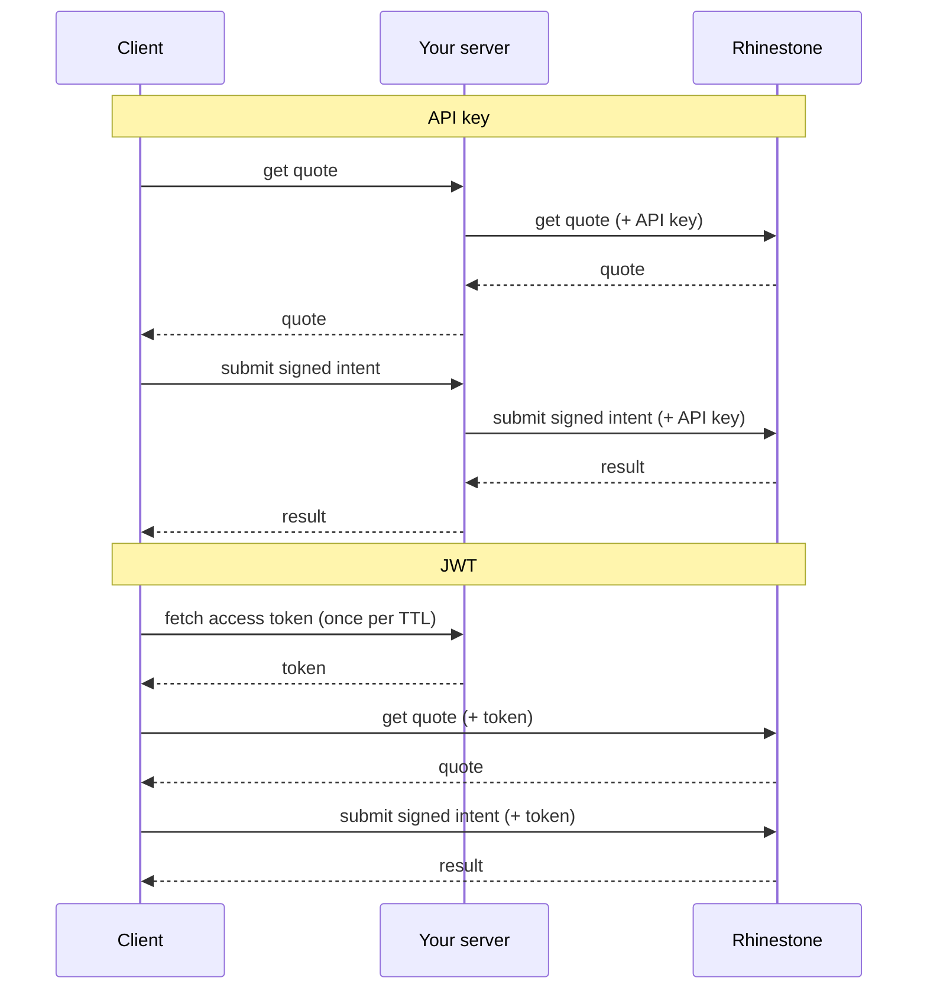

The SDK supports two authentication modes: **API key** and **JWT**. API keys are the default and easiest way to get started. JWTs are an alternative for integrators that need finer-grained control over token lifetime, key rotation, or per-request sponsorship policies.

<Note>JWT authentication is **experimental**. The config option is prefixed with `experimental_` and the API may change in future versions.</Note>

## Why JWTs

JWTs are short-lived, asymmetrically-signed tokens (RS256 or ES256) issued by your backend. Compared to a long-lived API key, they let you:

- **Cut latency and backend code.** Clients hit Rhinestone directly with a bounded access token instead of round-tripping through your server for every SDK call. For sponsored intents, a separate extension token binds your approval to the exact payload — so you stay in control per intent without proxying the submission.
- **Bound the blast radius of a leaked credential.** Access tokens expire on a TTL you choose. An API key stays valid until you notice and rotate it.
- **Rotate signing keys without downtime.** Register a new `kid`, start minting tokens with it, and tokens signed under the old `kid` keep verifying until they expire. No coordinated client deploy, no revocation race.

For unsponsored intents, the difference in hops looks like this:



## Dashboard setup

Before you can issue JWTs, you need to register a signing key with Rhinestone. Keys are managed per-project from the [Dashboard](https://dashboard.rhinestone.dev) under **Auth → JWT Keys**.

### Viewing your keys

Open the "JWT Keys" tab. If you haven't added a key yet, the list is empty:

<Frame>
  
</Frame>

### Adding a key

Press "+ Add Key" to open the key creation modal. There are two ways to add a key: generate a new keypair in the browser, or upload a public JWK you've created yourself.

<Tabs>
<Tab title="Generate">

The dashboard can generate a keypair directly in your browser. Only the public key is sent to Rhinestone — the private key stays on your machine.

<Steps>
<Step title="Fill in the form">

<Frame>
  
</Frame>

- **Integrator ID** — identifier for your organisation, emitted as the `iss` claim in the JWTs you'll sign. Typically the name of your service.
- **Key ID** — identifier for this specific public key, emitted as the `kid` JOSE header. Use a stable name you can rotate later (e.g. `prod-2026-04`).

Press "Add Key" to generate the keypair and register the public half.

</Step>
<Step title="Save the private key">

The dashboard shows the private key **once**. Download the `.json` file and store it somewhere safe — Rhinestone never sees it and it cannot be recovered:

<Frame>
  
</Frame>

<Warning>If you lose the private key, you'll need to register a new one and rotate any clients using the old `kid`.</Warning>

</Step>
</Steps>

</Tab>
<Tab title="Upload">

If you've generated a keypair yourself (for example, to store it in a secrets manager first), paste or drag the public JWK JSON into the form:

<Frame>
  
</Frame>

The same **Integrator ID** and **Key ID** rules apply. Only the public key is uploaded.

</Tab>
</Tabs>

Once the key is created, it shows up in the list along with the integrator ID, status, and creation time:

<Frame>
  
</Frame>

## Configuration

Signing a JWT requires five values. Three come from the Dashboard; the other two are free-form labels you pick yourself.

| Field | Where from | JWT claim |
|-------|------------|-----------|
| `privateKey` | Downloaded once when the key was generated (or supplied at registration) | n/a — signs the token |
| `integratorId` | Dashboard — set when registering the key | `iss` |
| `keyId` | Dashboard — set when registering the key | `kid` (JOSE header) |
| `projectId` | Dashboard — shown on the project overview | `sub` |
| `appId` | You choose | `app_id` |

**`integratorId`, `keyId`, and `projectId`** are verified server-side. The access token's `(iss, kid)` must resolve to a registered key, and the token's `sub` must equal the project that key was registered against. Mismatches produce a `401` or `403` at verification time — see [Troubleshooting](#troubleshooting).

**`appId`** is a free-form environment/app label — typically `prod`, `staging`, etc. It isn't registered anywhere. The only server-side check is that the access token's `app_id` matches the accompanying intent-extension token's `app_id`, so a sponsorship approval issued for one deployment can't be spent by another. Use it to correlate logs or split rate limits per deployment; if you don't need that, use the same value everywhere.

<Note>`keyId` and `appId` are independent axes. `keyId` rotates on **key rotation** (same deployment, new signing key). `appId` rotates on **environment changes** (same key, new deployment). You can reuse one signing key across multiple environments, or rotate keys within a single environment.</Note>

## SDK usage

There are two integration patterns depending on where the signing key lives.

<Tabs>
<Tab title="Client-server">

When the SDK runs on the client (browser, mobile) and a separate backend holds the private key, fetch tokens from your backend over HTTP:

```ts
const rhinestone = new RhinestoneSDK({
  auth: {
    mode: 'experimental_jwt',
    accessToken: async () => {
      const res = await fetch('/api/auth/access-token')
      const { token } = await res.json()
      return token
    },
    // Only required for sponsored intents:
    getIntentExtensionToken: async (intentInput) => {
      const res = await fetch('/api/auth/extension-token', {
        method: 'POST',
        headers: { 'Content-Type': 'application/json' },
        body: JSON.stringify({ intentInput }),
      })
      const { token } = await res.json()
      return token
    },
  },
})
```

Your backend is responsible for issuing the two token types. See [Sponsorship signing server](#sponsorship-signing-server) for a drop-in implementation.

</Tab>
<Tab title="Same-host">

When the SDK runs server-side with direct access to the private key, use `createJwtSigner` to sign tokens in-process without an HTTP round-trip:

```ts
import { createJwtSigner } from '@rhinestone/sdk/jwt-server'

const signer = createJwtSigner({
  jwt: {
    privateKey: myJwk,
    integratorId: 'int_abc',
    projectId: 'proj_xyz',
    appId: 'app_prod',
    keyId: 'key_1',
  },
})

const rhinestone = new RhinestoneSDK({
  auth: { mode: 'experimental_jwt', ...signer },
})
```

`createJwtSigner` returns `{ accessToken, getIntentExtensionToken }` — the two callbacks the `auth` config expects, so you can spread them in next to the `mode` field.

</Tab>
</Tabs>

## Sponsorship signing server

For the client-server pattern, your backend needs two endpoints: one that issues short-lived access tokens, and one that signs an intent extension token for each sponsored intent. The SDK ships ready-made handlers for both.

### Web standard handlers

The Web Standard handlers accept a `Request` and return a `Response`. They work with Next.js App Router, Hono, SvelteKit, Remix, Deno, Bun, and Cloudflare Workers:

```ts
import {
  createAccessTokenHandler,
  createExtensionTokenHandler,
} from '@rhinestone/sdk/jwt-server'

const config = {
  jwt: {
    privateKey: myJwk,
    integratorId: 'int_abc',
    projectId: 'proj_xyz',
    appId: 'app_prod',
    keyId: 'key_1',
  },
}

export const GET = createAccessTokenHandler(config)
export const POST = createExtensionTokenHandler(config)
```

### Express

For Express, use `createExpressRouter`. It mounts `GET /access-token` and `POST /extension-token`:

```ts
import express from 'express'
import { createExpressRouter } from '@rhinestone/sdk/jwt-server'

const app = express()
app.use(express.json())
app.use('/api/auth', createExpressRouter(config))
```

### Custom sponsorship policy

By default the signer sponsors any intent your users submit. To restrict this, pass a `shouldSponsor` filter. Each predicate can be sync or async, and omitted predicates default to `true`. Filters are AND-composed — the intent must pass all of them to be signed:

```ts
import { createJwtSigner } from '@rhinestone/sdk/jwt-server'
import { base, optimism } from 'viem/chains'

const signer = createJwtSigner({
  jwt: { privateKey, integratorId, projectId, appId, keyId },
  shouldSponsor: {
    chain: ({ id }) => [base.id, optimism.id].includes(id),
    account: async (address) => await isKnownUser(address),
    calls: (calls) => calls.every((c) => ALLOWED_CONTRACTS.has(c.to)),
  },
})
```

The same `shouldSponsor` config can be passed to the handler factories (`createAccessTokenHandler`, `createExtensionTokenHandler`, `createExpressRouter`).

Denied requests throw a `SponsorshipDeniedError`, which the handlers surface as a `403`. When calling the signer directly, the error is `instanceof`-checkable:

```ts
import { SponsorshipDeniedError } from '@rhinestone/sdk/jwt-server'

try {
  await signer.getIntentExtensionToken(intentInput)
} catch (error) {
  if (error instanceof SponsorshipDeniedError) {
    // intent was rejected by your policy
  }
  throw error
}
```

## Troubleshooting

Auth failures surface as HTTP 4xx responses with a `message` field. The common ones:

| Status | Message | Cause | Fix |
|--------|---------|-------|-----|
| 401 | `Unknown integrator key: iss=<x>, kid=<y>` | No registered key matches the `(iss, kid)` pair in the token | Confirm `integratorId` and `keyId` exactly match the values shown in the Dashboard for this key |
| 401 | `access_token verification failed: ...` | Signature invalid, token expired, or wrong audience | Check that the private key matches the registered public key, that the system clock isn't skewed, and that the TTL isn't too short |
| 401 | `Invalid token type: expected "access", got "intent_extension"` | Extension token sent in the `Authorization` header (or vice versa) | Send the access token as `Authorization: Bearer`; send the extension token as `X-Intent-Extension: Bearer` |
| 403 | `access_token sub does not match the project bound to signing key` | `projectId` doesn't match the project this key was registered against | Copy the project ID from the Dashboard project page into your signer config |
| 403 | intent-extension binding failure | `iss` / `sub` / `app_id` differ between the access token and the extension token, or the `jti` has already been spent | Sign both tokens from the same config; mint a fresh extension token (new `jti`) when retrying a failed submit |

If you're hitting a 401 seconds after registering or rotating a key, the verification cache may briefly hold the old state — wait a minute and retry, or register under a fresh `kid`.
