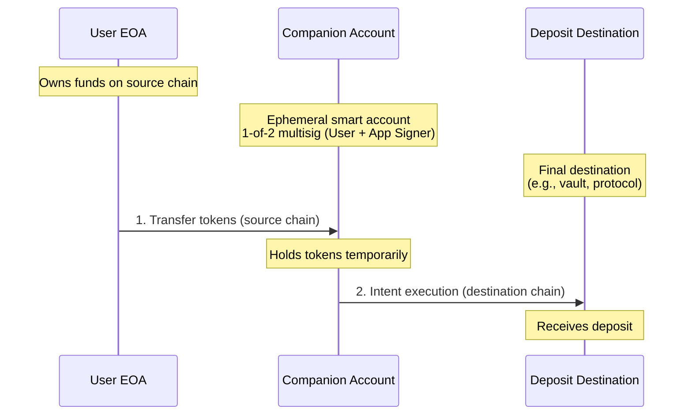

With Rhinestone, you can streamline deposits to your app from any chain by implementing a "single interaction" interface.

The flow works as follows:

1. You get a quote from Rhinestone to find the optimal path
2. If the user already has enough tokens on the deposit chain, you initiate a regular ERC-20 token transfer
3. For cross-chain transfers, you create a non-custodial ephemeral smart account with a key stored in your app
4. The user funds the account by making a token transfer to the smart account
5. Under the hood, the smart account executes the intent

This way, the user only needs to approve a single transaction (ERC-20 token transfer from the source chain).

The companion account is a 1-of-2 multisig where both your app's signer and the user can operate. This means funds are never custodial—even if your app goes offline, the user can always recover funds using their wallet.

## Getting a Quote

Start by getting a deposit quote from Rhinestone:

```json
{
  // Your app's chain (e.g., Base)
  "destinationChainId": 8453,
  // The address and the amount of the deposit token (e.g., 10 USDC)
  "tokenRequests": [{
    "tokenAddress": "0x833589fCD6eDb6E08f4c7C32D4f71b54bdA02913",
    "amount": "10000000"
  }],
  // Your user's address
  "account": {
    "address": "0xd8dA6BF26964aF9D7eEd9e03E53415D37aA96045"
  },
  // Optional: constrain the source tokens
  "accountAccessList": {
    "chainTokens": {
      "1": ["0xC02aaA39b223FE8D0A0e5C4F27eAD9083C756Cc2"]
    }
  }
}
```

<Note>The API uses `accountAccessList` to specify which tokens can be spent. When using the SDK's `prepareTransaction`, the equivalent parameter is called `sourceAssets`.</Note>

## Companion Account

The following diagram shows the three key addresses involved in a cross-chain deposit:



Create a "companion" smart account for the user. The simplest way to do it is to use [the Rhinestone SDK](../../smart-wallet/quickstart):

```ts
import { RhinestoneSDK } from "@rhinestone/sdk";
import { toViewOnlyAccount } from "@rhinestone/sdk/utils";

const rhinestone = new RhinestoneSDK({
  // The endpoint of the API proxy, see our "Security" guide
  endpointUrl: `${appBaseUrl}/api`,
});

// Read-only reference to the user's EOA
const ownerAccount = toViewOnlyAccount(ownerAddress);

// Signer of the smart account stored in your app
// Make sure to persist this
const signerPk = generatePrivateKey();
const signerAccount = getSignerAccount(signerPk);

const account = await rhinestone.createAccount({
  owners: {
    type: "ecdsa",
    accounts: [ownerAccount, signerAccount],
  },
});
```

This smart account is a 1-of-2 multisig where both your app's signer and the user can operate.

In most cases, this account will be operated by your app (with the key stored on-device). The user will only approve actions for this account in emergency situations (e.g., to recover the funds if the app's private key is lost).

This account will only be funded to execute deposit intents.

## Account Funding

Now, prompt the user to fund this "companion" account by making a token transfer to it:

```ts
const transferHash = await writeContract(wagmiConfig, {
  address: token.address,
  abi: erc20Abi,
  functionName: "transfer",
  args: [companionAccountAddress, transferAmount],
});

await waitForTransactionReceipt(wagmiConfig, {
  hash: transferHash,
  chainId: chain.id,
});
```

<Note>When deciding the fund amount, consider the gas costs to deploy the smart account, the potential price fluctuations, and the existing companion account balance if it has been used before.</Note>

<Note>For native token deposits (e.g., ETH), transfer the native token directly to the companion account. The intent system will handle wrapping to WETH internally since Permit2 only supports ERC-20 tokens.</Note>

## Executing the Intent

<Note>You might need to wait a few seconds between funding the account and executing the deposit to ensure balances are updated.</Note>

Finally, you can execute the deposit intent. Using the ephemeral account you've created for the user:

```ts
await companionAccount.sendTransaction({
  targetChain: depositChain,
  calls: [],
  tokenRequests: [
    {
      address: depositTokenAddress,
      amount: depositAmount,
    },
  ],
  recipient: {
    address: depositAddress,
  },
  signers: {
    type: "owner",
    kind: "ecdsa",
    // The signer you've created before
    accounts: [signerAccount],
  },
});
```

Since we're using the local signer private key, there will be no additional user interaction for this step.

<Note>After submitting the intent, poll the intent status until it reaches a terminal state (`COMPLETED`, `FILLED`, `FAILED`, or `EXPIRED`). This typically takes a few seconds for cross-chain settlements.</Note>

Once the intent is executed, the deposit will be complete.

## Recovery

If a deposit fails mid-flow (e.g., the user closes the app after funding but before intent execution), funds remain safe in the companion account. Since the user's EOA is a co-owner of the 1-of-2 multisig, they can always recover funds by signing a withdrawal transaction directly.

Make sure to persist the app's signer key so you can retry failed intents without requiring the user to re-fund the account.
